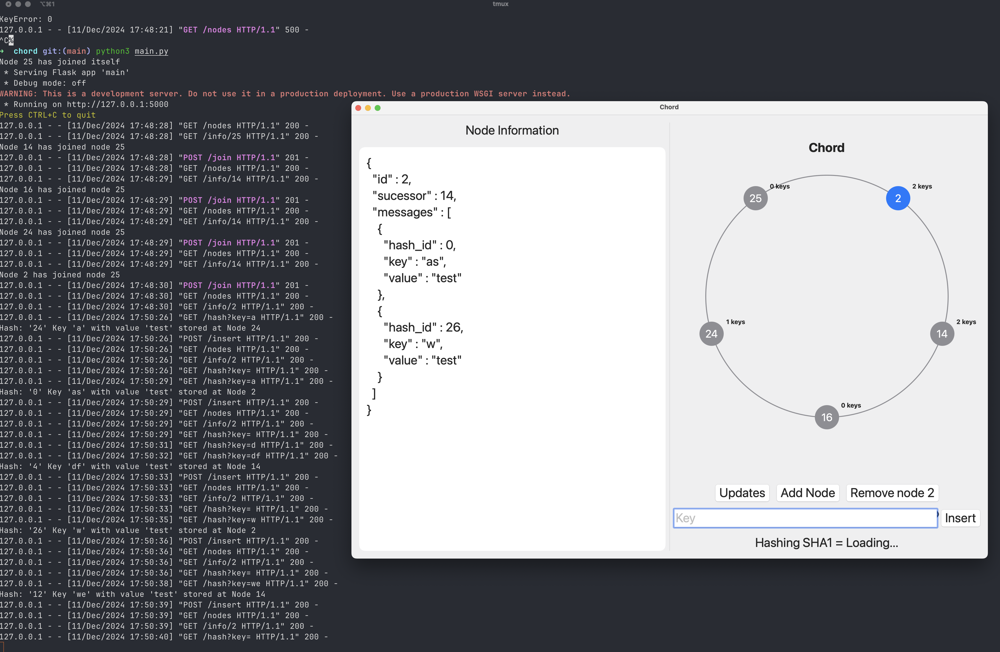
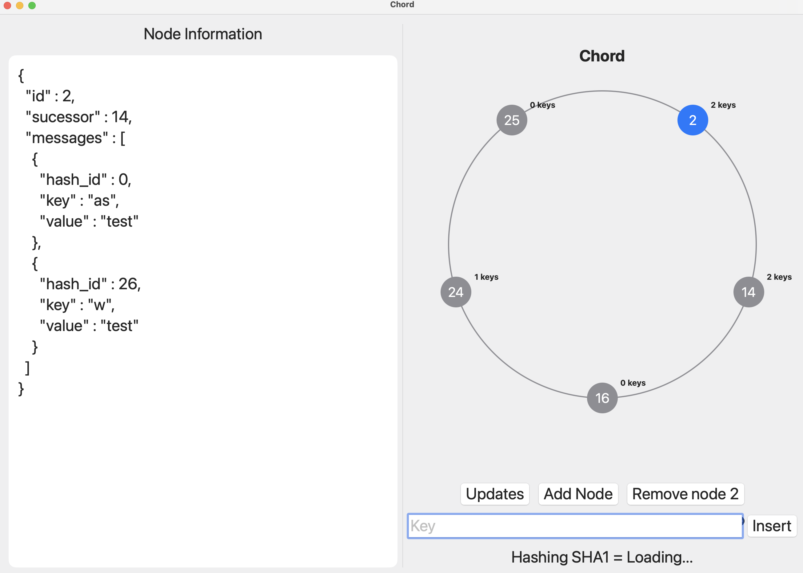

# Chord Application

A simple application to run and demonstrate chord functionality.

## Getting Started

### Backend Setup

1. Clone the backend repository:
```bash
git clone https://github.com/onggiahuy97/chord
```

2. Follow the installation instructions in the backend repository to set up and run the chord server.

### Running the Application

1. Download this repository to your local machine
2. Open the project in Xcode
3. Build and run the application (⌘ + R)

## Demo

Here's how the application looks in action:


*Screenshot showing the main interface*


*Screenshot demonstrating chord functionality*
